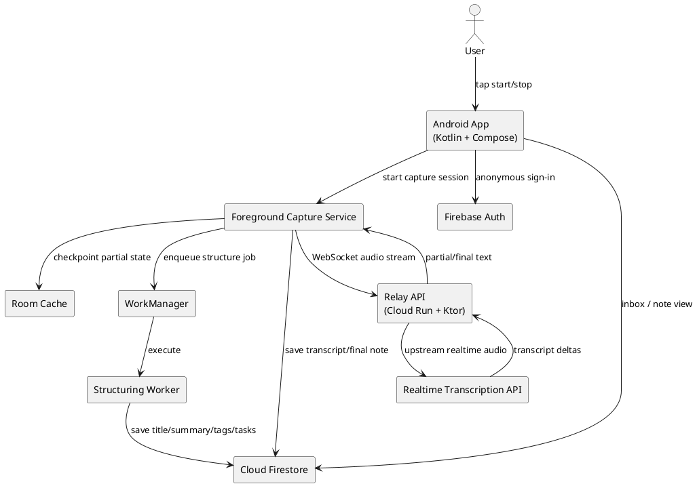
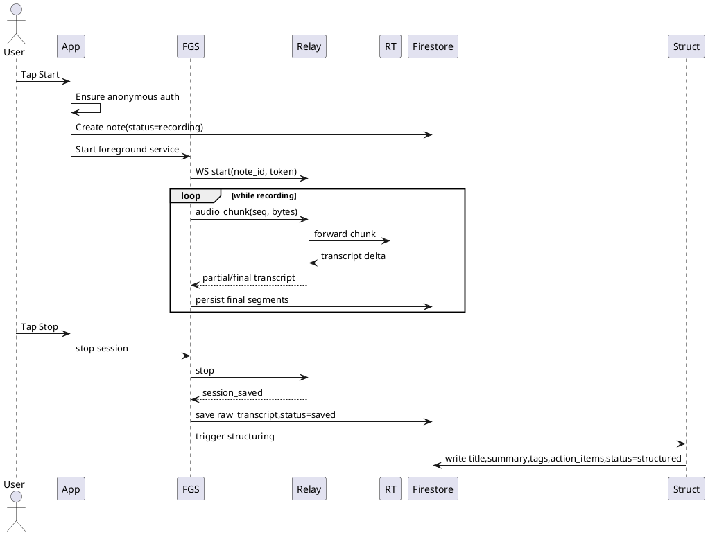

# SPEC-1: Idea Capture Transcription App

## Background

People often lose good ideas because capture is slower than thinking. Opening a notes app, typing, organizing, and naming thoughts adds too much friction in the moment. The product is a solo mobile app optimized for thought-speed capture: one action to start recording, live transcription as the user speaks, automatic save, and optional post-processing that turns the raw transcript into a cleaner structured note without interrupting capture.

## Requirements

### Must Have

* Mobile-first application for a single user, with anonymous use supported in MVP.
* One-tap start for voice capture from the main screen.
* Live streaming transcription during recording.
* Automatic save of transcript at stop, app backgrounding, or interrupted session recovery.
* Transcript-only note storage for MVP; no audio playback required.
* Android-only MVP with a native Kotlin implementation.
* Tap once to start capture and tap again to stop capture.
* Support recording and live transcription while the app is backgrounded using an Android foreground service and persistent notification.
* Raw transcript preserved exactly as spoken.
* Automatic post-capture structuring after every recording to generate cleaned title, summary, tags, and extracted action items/tasks.
* Searchable note inbox ordered by recency.
* Online-only architecture for MVP.
* Low-friction UX with minimal fields required during capture.

### Should Have

* Edit transcript after capture.
* Retry auto-structure if the first result is poor.
* Basic note metadata such as created time, updated time, duration, and processing status.
* Soft delete / archive for notes.
* Optional account linking so an anonymous user can later attach notes to an account and sync across devices.

### Could Have

* Home screen widget / lock-screen shortcut for fast capture.
* Share transcript to other apps.
* Simple tag filters in inbox.
* Export notes as plain text or markdown.
* Lightweight web viewer later.

### Won't Have (MVP)

* Team collaboration or shared workspaces.
* Offline transcription.
* Audio playback or synchronized transcript-to-audio navigation.
* Complex project/folder hierarchy.
* Multi-language optimization beyond a default primary language.

## Method

### Architecture Overview

The MVP uses a native Android client optimized for fast capture, a lightweight streaming backend, managed authentication, and cloud note storage.

**Client**

* Kotlin Android app.
* Jetpack Compose for UI. Android documentation positions Compose as the modern toolkit for Android UI, and the Compose BOM released in August 2025 includes stable Compose 1.9, which is an appropriate baseline for MVP implementation.
* Android foreground service for background recording/transcription. Android documentation requires foreground service types and matching permissions for apps targeting Android 14+.
* WorkManager for deferred cleanup, retry, and post-processing jobs that must survive app restarts.

**Platform services**

* Firebase Authentication with anonymous sign-in at first launch, allowing immediate use and later account linking.
* Cloud Firestore for note metadata, transcript text, task extraction results, and device/user linkage.
* Cloud Run WebSocket service as a streaming relay between the Android app and the transcription provider. Google documents WebSocket support on Cloud Run, making it suitable for persistent low-latency connections.
* OpenAI Realtime API for low-latency audio transcription over a persistent connection.
* Optional LLM post-processing step after capture completion to produce title, summary, tags, and action items from the raw transcript.

### Why this method

This architecture optimizes for the core product promise: capture ideas at thought speed.

* Anonymous auth removes onboarding friction.
* A foreground service allows recording/transcription to continue when the user locks the phone or switches apps.
* A server relay keeps provider credentials off-device and centralizes throttling, observability, and provider swapping.
* Firestore reduces backend CRUD complexity and supports real-time list updates to the inbox.
* WorkManager handles retries for structuring and interrupted session recovery without forcing the app to stay open.

### Comparable products and lessons applied

Existing products with adjacent behavior include voice note and meeting-note tools such as Otter, Granola, and general quick-capture note apps. Their strongest shared lesson is that the winning UX minimizes pre-capture decisions. For this MVP, that translates into:

* open app -> tap once -> speak,
* see words appear live,
* stop and trust autosave,
* optionally clean up afterward.

Unlike meeting assistants, this app is optimized for single-user, short, spontaneous captures rather than long collaborative sessions.

### High-level components

1. **Capture UI**

   * Main screen with large capture button.
   * Session state: Idle, Connecting, Recording, Reconnecting, Structuring, Saved, Failed.
   * Live transcript pane updates incrementally.

2. **Capture Service**

   * ForegroundService with persistent notification.
   * Manages microphone input, audio chunking, websocket session, heartbeat, and reconnection.
   * Buffers transcript deltas locally in memory and checkpoints to local storage every few seconds.

3. **Session Sync Layer**

   * Sends audio chunks to backend relay.
   * Receives transcript deltas and partial/final segment markers.
   * Commits finalized transcript segments to Firestore.

4. **Structuring Pipeline**

   * Triggered automatically after capture stop for every note in MVP.
   * Generates cleaned title, concise summary, tags, and extracted action items/tasks.

5. **Inbox/Search**

   * Firestore-backed notes list ordered by `updated_at desc`.
   * Prefix search and lightweight local cache for recent notes.
   * Full semantic search can be deferred beyond MVP.

### Data model

Because Firestore is document-oriented, the simplest scalable model is one top-level user scope containing note documents.

#### Collections

```text
anonymous_devices/{device_id}
users/{user_id}
users/{user_id}/notes/{note_id}
```

For anonymous-only sessions before account linking, the app stores against a generated Firebase anonymous user ID. When the user upgrades, credentials are linked and ownership remains intact.

#### Note document schema

```json
{
  "note_id": "uuid",
  "owner_uid": "firebase_uid",
  "device_id": "android-installation-id",
  "status": "recording|transcribing|saved|structuring|structured|failed",
  "source": "voice_live",
  "raw_transcript": "full raw transcript text",
  "transcript_segments": [
    {
      "segment_id": "uuid",
      "start_ms": 0,
      "end_ms": 1820,
      "text": "I should build...",
      "is_final": true,
      "seq": 1
    }
  ],
  "structured": {
    "title": "Idea title",
    "summary": "2-4 sentence summary",
    "tags": ["mobile", "idea-capture"],
    "action_items": [
      {
        "id": "uuid",
        "text": "Prototype the record screen",
        "done": false
      }
    ],
    "structured_at": "timestamp"
  },
  "capture": {
    "started_at": "timestamp",
    "ended_at": "timestamp",
    "duration_ms": 48123,
    "language": "en-US",
    "background_mode_used": true
  },
  "audit": {
    "created_at": "timestamp",
    "updated_at": "timestamp",
    "deleted_at": null,
    "app_version": "1.0.0"
  }
}
```

#### Local persistence schema

Use Room for resilience, despite online-only behavior.

`local_note_sessions`

* `note_id TEXT PRIMARY KEY`
* `status TEXT NOT NULL`
* `partial_transcript TEXT NOT NULL`
* `last_ack_seq INTEGER NOT NULL`
* `started_at INTEGER NOT NULL`
* `updated_at INTEGER NOT NULL`
* `sync_state TEXT NOT NULL`

`local_transcript_segments`

* `note_id TEXT NOT NULL`
* `seq INTEGER NOT NULL`
* `text TEXT NOT NULL`
* `is_final INTEGER NOT NULL`
* `PRIMARY KEY(note_id, seq)`

This local store is not for offline product support; it is for crash recovery, reconnection, and idempotent upload.

### Core flows

#### 1. Start capture

* User taps record.
* App ensures anonymous Firebase session exists.
* App creates note stub in Firestore with status `recording`.
* App starts ForegroundService.
* Service opens WebSocket to backend relay.
* Service streams encoded audio chunks.
* Relay forwards chunks to transcription provider.
* Transcript deltas stream back to the device UI.

#### 2. Background continuation

* User switches apps or locks device.
* Foreground service remains alive with ongoing notification.
* Service continues audio capture and WebSocket streaming.
* UI can detach safely; session continues.
* On return, UI rebinds to service and resumes live transcript rendering.

#### 3. Stop capture

* User taps stop from app or notification action.
* Service sends end-of-stream marker.
* Final transcript is assembled from final segments.
* Firestore note is updated to `saved`.
* Structuring job is enqueued.

#### 4. Structuring

* Backend or worker sends raw transcript to LLM.
* Response is validated against schema:

  * title length,
  * non-empty summary,
  * tags array,
  * action_items array.
* Structured fields written back to Firestore.
* Note status becomes `structured`.

#### 5. Recovery / retry

* If network drops, service enters `reconnecting`.
* Audio capture can continue briefly while an upload buffer remains under size cap.
* If relay reconnect succeeds, stream resumes.
* If finalization fails, WorkManager enqueues retry using unique work per note.

### API design

#### Android <-> Relay WebSocket

`wss://api.example.com/v1/stream/transcribe`

Client -> server messages:

```json
{ "type": "start", "note_id": "uuid", "token": "firebase_id_token", "language": "en-US", "sample_rate": 16000 }
{ "type": "audio_chunk", "seq": 1, "audio_b64": "..." }
{ "type": "stop" }
{ "type": "ping", "ts": 1712345678 }
```

Server -> client messages:

```json
{ "type": "ack", "seq": 1 }
{ "type": "partial_transcript", "seq": 14, "text": "build an app for" }
{ "type": "final_transcript", "seq": 15, "start_ms": 1200, "end_ms": 2650, "text": "build an app for immediate transcription" }
{ "type": "session_saved", "note_id": "uuid" }
{ "type": "error", "code": "UPSTREAM_TIMEOUT", "message": "..." }
```

#### Internal backend endpoints

* `POST /v1/notes/{noteId}/structure`
* `POST /v1/auth/link-account`
* `GET /healthz`

### Algorithms and policies

#### Transcript assembly

* Maintain ordered map of transcript segments by `seq`.
* Render partial text separately from committed final text.
* Only append to `raw_transcript` when a segment is final.
* Keep deduplication key `(note_id, seq)` to prevent duplicate writes on reconnect.

#### Action item extraction contract

Return structured JSON in this shape:

```json
{
  "title": "string",
  "summary": "string",
  "tags": ["string"],
  "action_items": [
    { "text": "string" }
  ]
}
```

Validation rules:

* maximum 1 title,
* summary <= 600 characters,
* max 10 tags,
* max 20 action items,
* discard empty or duplicate tasks.

#### Reconnection policy

* exponential backoff: 1s, 2s, 4s, 8s, max 15s.
* keep at most 30 seconds of unsent compressed audio in memory.
* if buffer exceeds cap, stop session and save partial transcript with failure reason.

#### Idempotency

* All client note creation uses UUIDv7 note IDs.
* Segment writes keyed by `(note_id, seq)`.
* Structuring requests include `idempotency_key = note_id + transcript_revision`.

### Security and privacy

* No provider secret keys stored on device.
* Android app authenticates to backend using Firebase ID token.
* Backend verifies token before opening upstream transcription session.
* Firestore security rules restrict read/write to the authenticated owner UID.
* Anonymous users are still authenticated users under Firebase auth.
* Store transcript text in cloud storage/database as requested; do not store audio in MVP.
* Redact logs to exclude transcript content in production.

### Reliability and observability

* Cloud Run service emits structured logs with `note_id`, `uid`, `session_id`, latency, reconnect_count, and error_code.
* Metrics to track:

  * transcription start latency,
  * median partial transcript latency,
  * save success rate,
  * structuring success rate,
  * foreground-service interruption rate,
  * note loss incidents.
* Alert on repeated upstream transcription failures or save failures.

### Recommended stack versions / baselines

* **Android UI:** Jetpack Compose using the current stable BOM line that includes Compose 1.9.
* **Networking:** Ktor 3.4.2 for backend and optionally for Android WebSocket client.
* **Background reliability:** WorkManager current Jetpack release line.
* **Authentication / data:** Firebase Authentication + Cloud Firestore.
* **Backend runtime:** Cloud Run with WebSocket support.
* **Transcription / structuring:** OpenAI Realtime API for live transcription and an LLM completion step for post-capture structuring.

### PlantUML - component diagram



### PlantUML - sequence diagram



## Implementation

### Phase 1: Foundation

1. Create Android project in Kotlin with Compose and Material 3.
2. Configure Firebase project, anonymous auth, and Firestore security rules.
3. Implement anonymous bootstrap on first launch.
4. Build inbox and note detail screens backed by Firestore listeners.

### Phase 2: Capture engine

1. Implement microphone capture pipeline in a foreground service.
2. Add persistent notification with stop action.
3. Add local Room checkpointing for session recovery.
4. Handle app backgrounding, process recreation, and UI rebinding to active service.

### Phase 3: Streaming backend

1. Build Ktor WebSocket relay on Cloud Run.
2. Verify Firebase ID tokens server-side.
3. Proxy audio to transcription provider and forward transcript deltas to client.
4. Add structured logging, note/session correlation IDs, and rate limiting.

### Phase 4: Persistence and structuring

1. Finalize transcript assembly rules.
2. Save final transcript and metadata to Firestore.
3. Implement post-capture structuring endpoint/job.
4. Validate and persist title, summary, tags, and action items.

### Phase 5: Hardening

1. Add reconnect logic and bounded audio buffer.
2. Add WorkManager retries for failed finalization/structuring.
3. Add soft delete/archive.
4. Add analytics and SLO dashboards.

### Suggested repository layout

```text
mobile-android/
  app/
  feature-capture/
  feature-inbox/
  feature-note/
  core-network/
  core-data/
  core-auth/
backend-relay/
  src/
  test/
infrastructure/
  firestore.rules
  cloudrun/
```

## Milestones

### Milestone 1: Usable capture prototype

* Anonymous launch works.
* User can tap start/stop.
* Live transcript appears on device.
* Transcript saves successfully for a single session.

### Milestone 2: Reliable background capture

* Foreground service survives screen lock and app switching.
* Recovery works after transient network loss.
* Partial sessions are not lost on process death.

### Milestone 3: Structured notes MVP

* Title, summary, tags, and tasks generated automatically.
* Inbox refreshes with completed structured notes.
* User can edit transcript and rerun structuring if needed.

### Milestone 4: Production readiness

* Crash-free rate and latency targets met.
* Logging, metrics, and alerting in place.
* Security rules, abuse limits, and retention policy reviewed.

## Gathering Results

Success should be measured against the product promise: users can capture ideas before they forget them.

### Product metrics

* Time from app open to recording start.
* Median latency to first visible transcript token.
* Percentage of sessions saved without user-visible error.
* Percentage of notes that receive successful structuring.
* 7-day retention for users who create at least one note.
* Average notes captured per active user per week.

### Quality targets

* P50 time to first transcript token: < 1.5 seconds.
* P95 save success: > 99%.
* Structured-note success: > 95%.
* Lost-note rate: < 0.1% of sessions.

### Post-production evaluation

* Interview early users after 1 week and 3 weeks.
* Review whether tasks extracted are actually useful or noisy.
* Check whether background capture materially increases completion rate.
* Identify whether search quality is sufficient without semantic retrieval.

### Exit criteria for MVP success

The MVP is successful if users consistently complete voice captures with minimal friction, trust that notes are not lost, and receive useful structured summaries and action items.
